```{r setup, include = FALSE}
options(htmltools.dir.version = FALSE)
knitr::opts_chunk$set(message = FALSE, warning = FALSE, fig.align = "center")
xaringanExtra::use_tachyons()
xaringanExtra::use_tile_view()
xaringanExtra::use_panelset()
```

```{r library, include = FALSE}
library(tidyverse)
library(here)
```

# Trabajo de referencia

```{r, echo = FALSE, eval = TRUE, fig.asp = 2/2, out.width = "100%", fig.align = "center"}

```

<br/>

El [trabajo](https://www.ivie.es/es_ES/ptproyecto/distribucion-la-poblacion-acceso-los-servicios-publicos/) trata de poner en relación la distribución de la población sobre el territorio con la dotación de (algunos) centros de servicios y su accesibilidad: Sanidad, educación no universitaria y oficinas bancarias.

Ha sido refinado técnicamente en un trabajo posterior en [_Papeles de Economía Española_](https://www.funcas.es/revista/la-economia-espanola-ante-el-reto-demografico/) con básicamente las mismas conclusiones generales.

--

<br/>

En ambos casos se adopta una **perspectiva nacional**, una **escala local** (infra-municipal) y un **enfoque geográfico**.

???

Mejorar la accesibilidad a los servicios de interés general, públicos y privados, es una parte importante tanto de las políticas sociales como de las políticas territoriales de cohesión social.

La accesibilidad, entendida en un sentido amplio, tiene múltiples facetas y hace referencia a la facilidad con la que la población, dadas sus características y su distribución sobre el territorio, puede disfrutar de dichos servicios.

Con muy pocas excepciones los estudios generales sobre accesibilidad geográfica a servicios de interés general son de ámbito local o a lo sumo regional. La razón es que, desafortunadamente, información amplia y completa sobre la localización de este tipo de servicios no está disponible con generalidad.

---

# El origen... ¡un artículo de prensa! `r icons::icon_style(icons::fontawesome("newspaper"), fill = "blue")`

```{r, echo = FALSE, eval = TRUE, fig.asp = 2/2, out.width = "100%", fig.align = "center"}
knitr::include_url("https://elpais.com/politica/2019/10/25/actualidad/1572027354_718725.html")
```

```{r, echo = FALSE, eval = TRUE, fig.asp = 2/2, out.width = "85%", fig.align = "center"}
#knitr::include_graphics("./img/02_EL_Pais.jpg")
```

???

**Objetivo**: Mejorar la base de datos y hacerse una idea de la foto a nivel nacional.

---

exclude: true

# Antecedentes

.pull-left[

```{r, echo = FALSE, eval = TRUE, fig.asp = 2/2, out.width = "85%", fig.align = "center"}
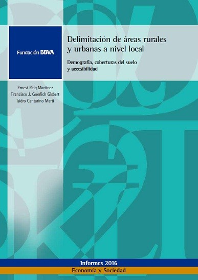
```

]

.pull-right[ 

```{r, echo = FALSE, eval = TRUE, fig.asp = 2/2, out.width = "90%", fig.align = "center"}
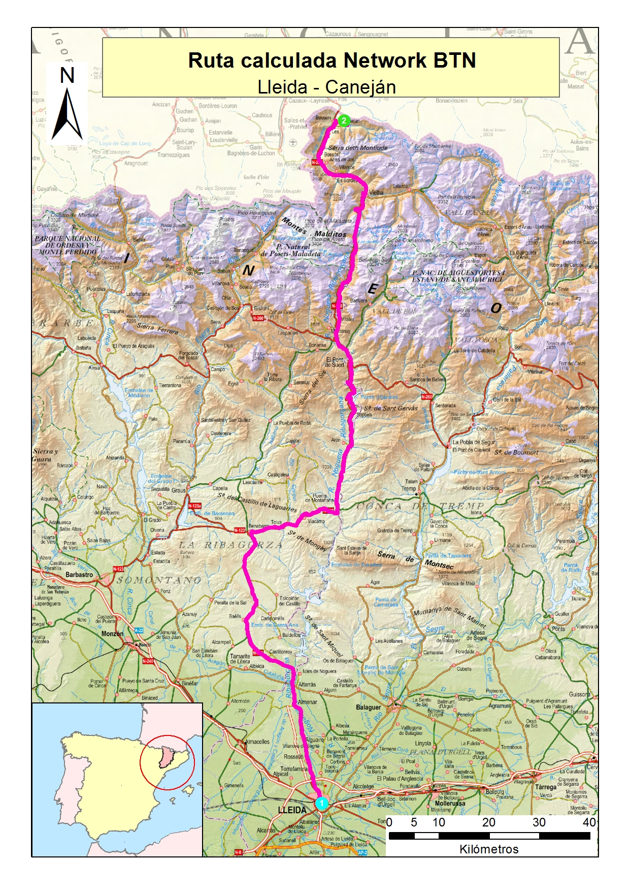
```

]

???

Ya habíamos mirado el tema de la accesibilidad en el contexto de la discriminación entre municipios rurales accesibles y remotos al hilo de una literatura europea que hace énfasis en el mejor desempeño de los municicipios rurales cercanos a las ciudades frente a los municipios remotos.

---

# La importancia de la cercanía

```{r, echo = FALSE, eval = TRUE, fig.asp = 2/2, out.width = "80%", fig.align = "center"}
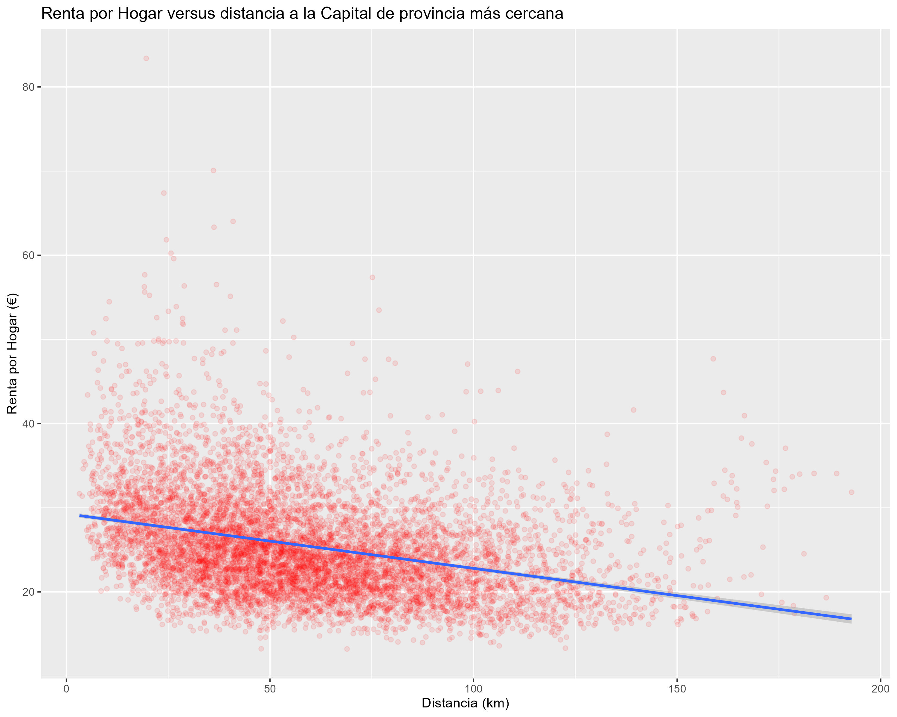
```

???

Una mirada a los datos muestra que los **municipios cercanos** a los grandes centros de servicio, _las ciudades_, tienden a mostrar **mejor desempeño** que los **municipios remotos**, alejados de los centros de servicios.

Ya sea en términos de la **cercanía** a la **capital de provincia** más cercana...

---

# La importancia de la cercanía

```{r, echo = FALSE, eval = TRUE, fig.asp = 2/2, out.width = "80%", fig.align = "center"}
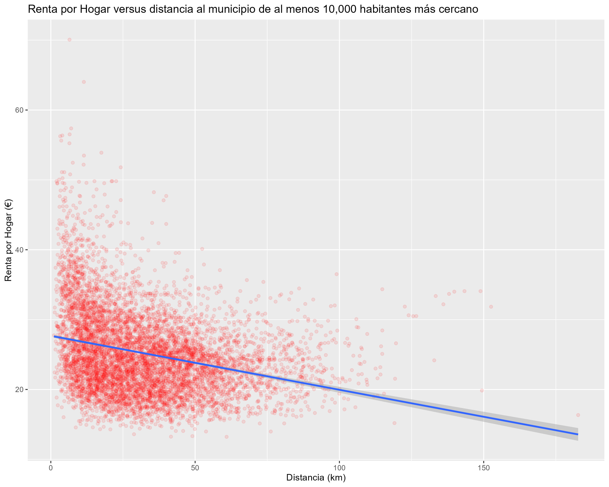
```

???

...o a un **municipio por encima de un determinado umbral**.

Aproximadamente el mismo patrón se observa para otros tamaños de municipios.

Si bien, la relación está lejos de ser lineal.

---

# Accesibilidad a los servicios

Una aproximación cuantitativa a la accesibilidad puede adoptar diferentes enfoques y ser medida de distintas formas.

En general, la accesibilidad es una combinación de dos funciones diferentes:

1. El **tipo de actividades** que se pueden/desean alcanzar.

2. El **coste** en el que debemos incurrir para alcanzarlas. Coste del usuario o del prestatario del servicio.

--

Nos centramos en servicios muy concretos y generales: **Sanidad** `r icons::icon_style(icons::fontawesome("hospital"), fill = "blue")`, **Educación no universitaria** `r icons::icon_style(icons::fontawesome("school"), fill = "blue")` y **Oficinas Bancarias** `r icons::icon_style(icons::ionicons("cash"), fill = "blue")`.

Y el **coste** por parte del que **accede al servicio** en términos de **distancia y/o tiempo de acceso**.

**No** consideramos el **coste de provisión**, ¡un olvido terriblemente importante!

En la accesibilidad a los servicios es uno de los ámbitos donde se hace más patente el **conflicto eficiencia-equidad**.

???

Una mayor provisión de servicios locales, especialmente en las zonas rurales más despobladas, contribuiría a reducir el déficit identificado en estas zonas frente a las zonas urbanas, y redundaría en mejoras sociales y de bienestar para algunos ciudadanos. Sin embargo, un aumento generalizado en la provisión de servicios públicos conllevaría perdidas de eficiencia, en tanto que dicho gasto elevaría el coste medio de los servicios por habitante. El mismo argumento se aplica a los servicios privados, que en el caso de no se rentables requirirían la intervención pública o, si se actúa vía la obligatoriedad en la provisión de dichos servicios, el reparto del coste entre todos los usuarios.

Este equilibrio debe resolverse en el ámbito político, en tanto que éste refleja, en teoría, la agregación de las preferencias de los individuos, pero es aconsejable que las decisiones se basen en la evidencia empírica.

---

class: inverse, center, middle

# Distribución de la población

<br/>

Sin **población**, `r icons::icon_style(icons::ionicons("people"), fill = "white")`, no hay servicios que prestar.

???

¡Debemos empezar por saber donde están los usuarios potenciales!

---

# Distribución de la población

La población española se ha multiplicado por 2.5 veces en los últimos 120 años... ¡pero muchos lugares han perdido población!

.center[**Variación absoluta de la población por municipios, 1900-2020**]

```{r, echo = FALSE, eval = TRUE, fig.asp = 2/2, out.width = "70%", fig.align = "center"}
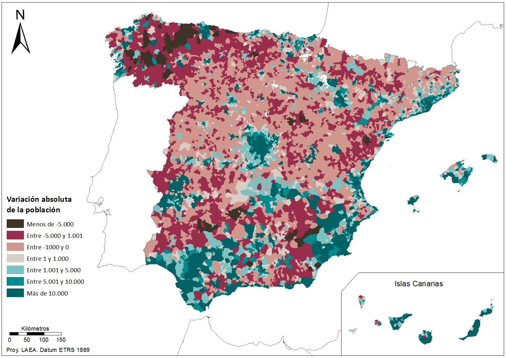
```

???

¡Estos son los territorios que decrecen!

---

class: center

#### Densidad de población

```{r, echo = FALSE, eval = TRUE, fig.asp = 2/2, out.width = "50%", out.height = "50%", fig.show = "hold", fig.align = "default"}
knitr::include_graphics(c("./img/08_Densidad_1900.jpg", "./img/09_Densidad_1950.jpg",
                          "./img/10_Densidad_2001.jpg", "./img/11_Densidad_2020.jpg"))
```

---

# ¡España está casi vacía!

.center[**Grid de población 2011 con tamaño de celda 1km x 1km**]

```{r, echo = FALSE, eval = TRUE, fig.asp = 2/2, out.width = "80%", fig.align = "center"}
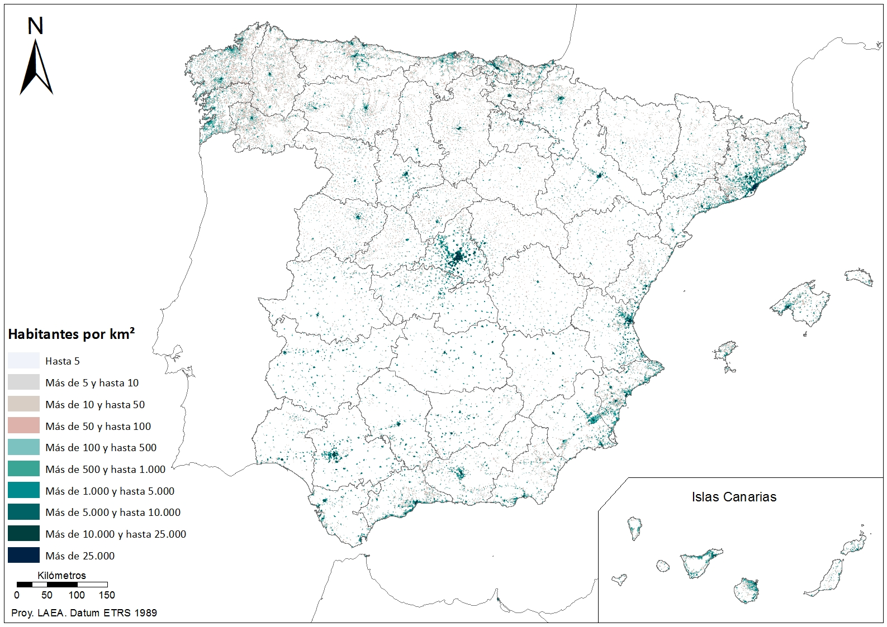
```

---

class: inverse, center, middle

### Si la población se ha multiplicado por 2.5 en el último siglo y

### una gran parte del territorio ha mermado...

<br/>

### _¿Donde ha ido la población?_

---

# A la costa...

```{r, echo = FALSE, eval = TRUE, fig.asp = 2/2, out.width = "85%", fig.align = "center"}
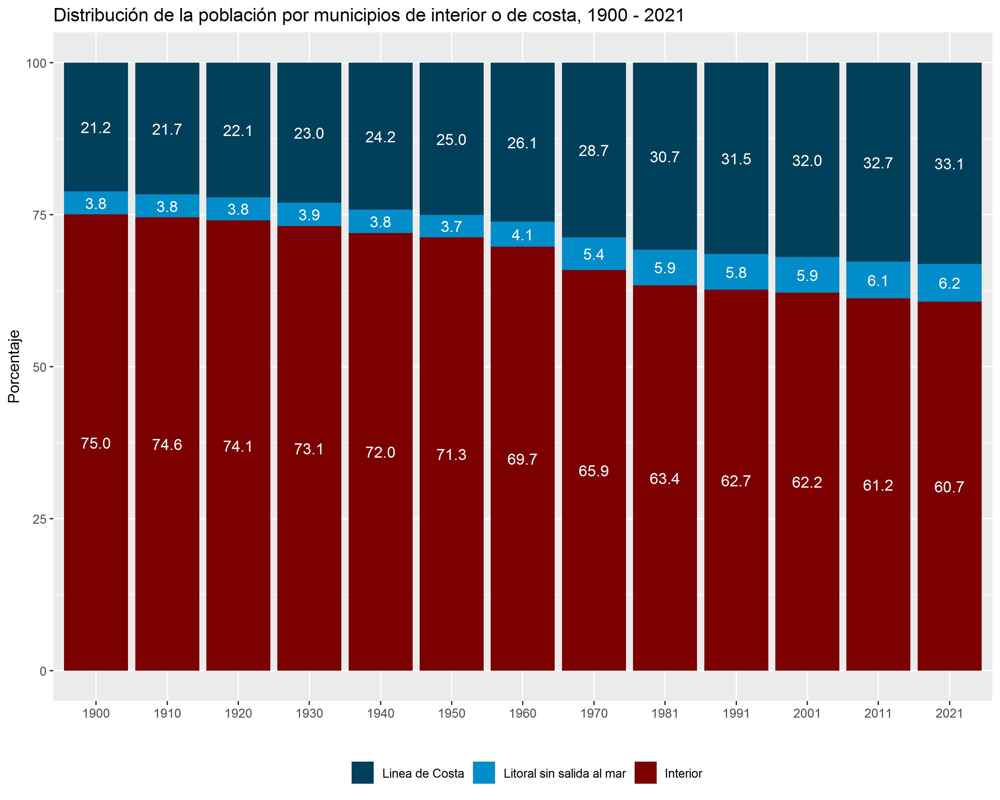
```

---

# Al valle...

```{r, echo = FALSE, eval = TRUE, fig.asp = 2/2, out.width = "85%", fig.align = "center"}
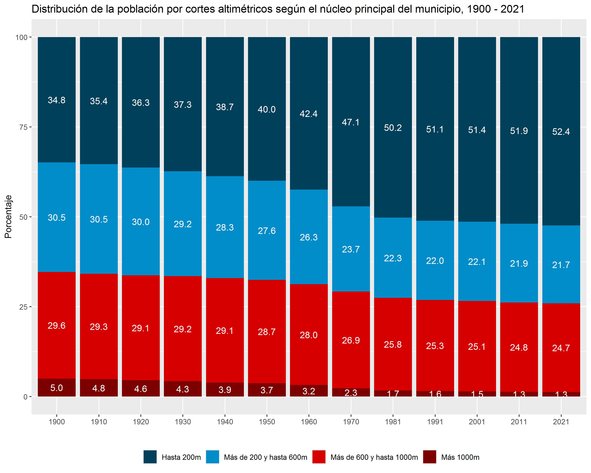
```

---

# A los municipios urbanos...

```{r, echo = FALSE, eval = TRUE, fig.asp = 2/2, out.width = "85%", fig.align = "center"}
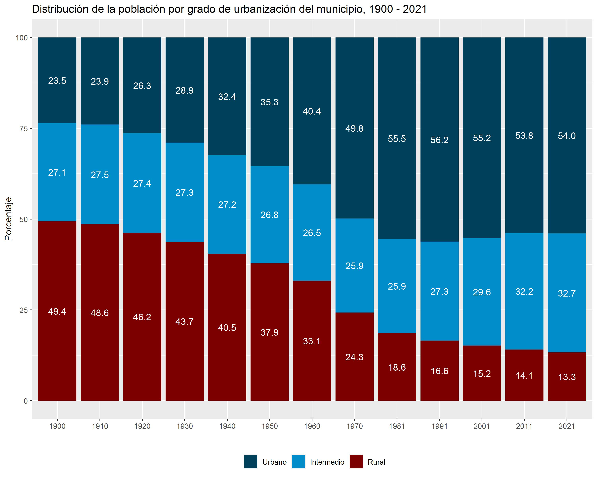
```

---

# A las capitales de provincia...

```{r, echo = FALSE, eval = TRUE, fig.asp = 2/2, out.width = "85%", fig.align = "center"}
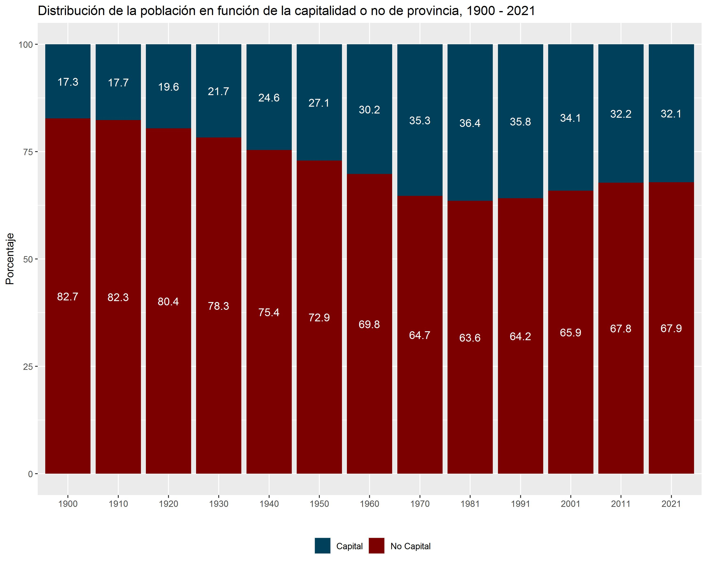
```

---

# A las áreas urbanas funcionales...

```{r, echo = FALSE, eval = TRUE, fig.asp = 2/2, out.width = "85%", fig.align = "center"}
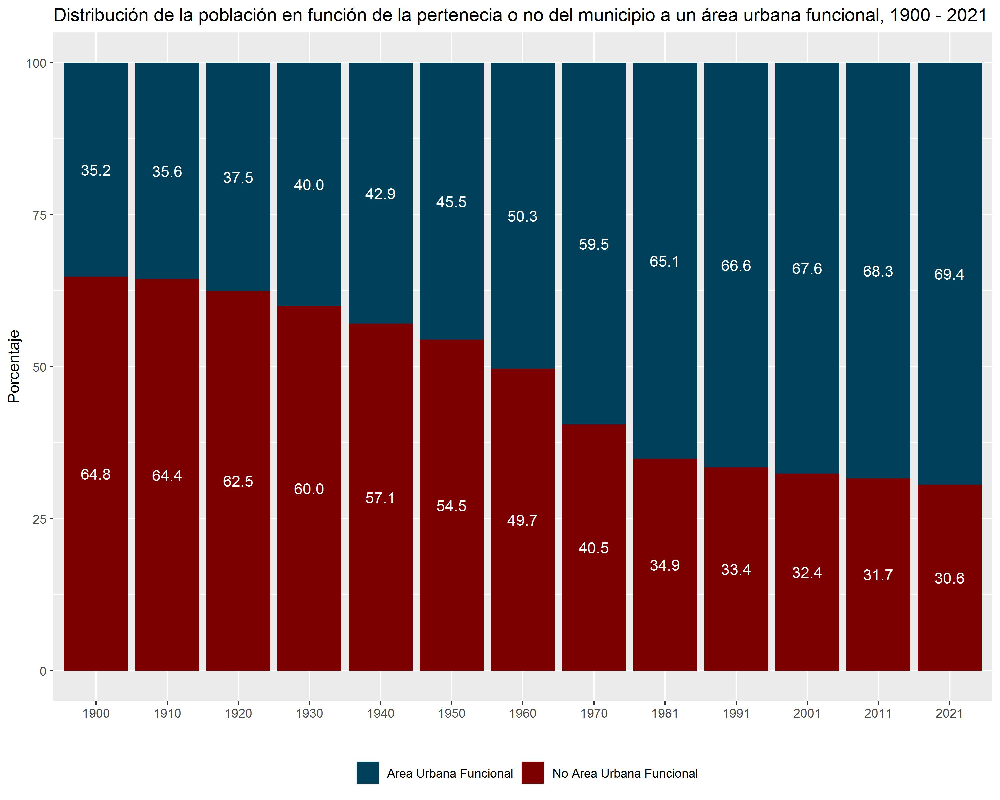
```

---

# A Madrid...

```{r, echo = FALSE, eval = TRUE, fig.asp = 2/2, out.width = "85%", fig.align = "center"}
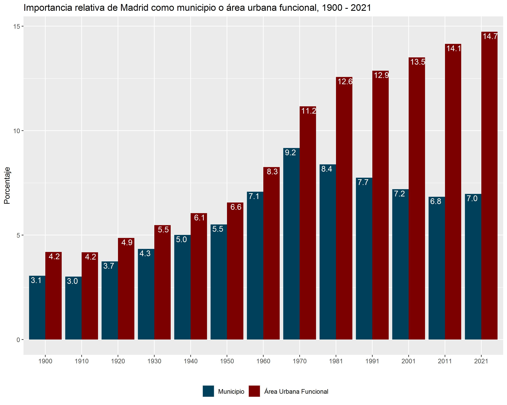
```

---

class: inverse, center, middle

### ¿Ha acabado este proceso de concentración de la población?

--

### _¡Yo creo que no!_

---

# Estructura sociodemográfica actual

La **principal particularidad demográfica** que ha dejado el éxodo rural de la segunda mitad siglo pasado es la **abundancia de lugares casi vacíos** y un notable proceso de **envejecimiento de la población** en amplias zonas de nuestro país.

<br/>

Este **proceso** no operó ni en todos los lugares, ni en todas las épocas de la misma forma, y **no** parece que esté **agotado**.

<br/>

¡Lo que llevamos de siglo XXI no ha conseguido revertir las tendencias previas! ¡Ni siquiera estabilizarlas!

<br/>

Debemos, pues, esperar que el proceso de concentración, y envejecimiento, de la población prosiga de forma lenta pero continuada en el tiempo.

---

exclude: true

### .center[Indicadores demográficos por grado de urbanización a nivel municipal]

```{r, echo = FALSE, eval = TRUE, fig.asp = 2/2, out.width = "100%", fig.align = "center"}
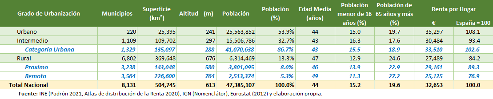
```

---

### .center[Indicadores demográficos por grado de urbanización a nivel municipal]

```{r, echo = FALSE, eval = TRUE, fig.asp = 2/2, out.width = "80%", fig.align = "center"}
data <- readxl::read_xlsx("./data/PEE_Accesibilidad.xlsx", sheet = "Cuadro 1", range = "A4:N10") %>%
  select(-2, -5, -12) %>%
  rename(`Grado de Urbanización` = 1, Municipios = 2, `Superficie (km²)` = 3, `Altitud (m)` = 4, `Población` = 5, `Población (%)` = 6,
         `Edad Media (años)` = 7, `Población menor de 16 años (%)` = 8, `Población de 65 años y más (%)` = 9,
         `Renta por Hogar (€)` = 10, `Renta por Hogar (España = 100)` = 11) %>%
  mutate(`Grado de Urbanización` = c("Urbano", "Intermedio", "Categoría Urbana", "Rural", "Rural Próximo", "Rural Remoto"),
         `Población (%)` = 100*`Población (%)`)

DT::datatable(data[c(1, 2, 4), ], extensions = "FixedColumns",
              options = list(dom = "rti", pageLength = 3, scrollX = TRUE, fixedColumns = list(leftColumns = 2))) %>%
  DT::formatRound("Municipios", digits = 0, mark = ".") %>%
  DT::formatRound("Superficie (km²)", digits = 0, mark = ".", dec.mark = ",") %>%
  DT::formatRound("Altitud (m)", digits = 0, mark = ".", dec.mark = ",") %>%
  DT::formatRound("Población", digits = 0, mark = ".", dec.mark = ",") %>%
  DT::formatRound("Población (%)", digits = 1, mark = ".", dec.mark = ",") %>%
  DT::formatRound("Edad Media (años)", digits = 0, mark = ".", dec.mark = ",") %>%
  DT::formatRound("Población menor de 16 años (%)", digits = 1, mark = ".", dec.mark = ",") %>%
  DT::formatRound("Población de 65 años y más (%)", digits = 1, mark = ".", dec.mark = ",") %>%
  DT::formatRound("Renta por Hogar (€)", digits = 0, mark = ".", dec.mark = ",") %>%
  DT::formatRound("Renta por Hogar (España = 100)", digits = 1, mark = ".", dec.mark = ",")
```

---

### .center[¿Y si dividimos los rurales en próximos a la ciudad y remotos?]

```{r, echo = FALSE, eval = TRUE, fig.asp = 2/2, out.width = "80%", fig.align = "center"}

DT::datatable(data[c(3, 5, 6), ], extensions = "FixedColumns",
              options = list(dom = "rti", pageLength = 3, scrollX = TRUE, fixedColumns = list(leftColumns = 2))) %>%
  DT::formatRound("Municipios", digits = 0, mark = ".") %>%
  DT::formatRound("Superficie (km²)", digits = 0, mark = ".", dec.mark = ",") %>%
  DT::formatRound("Altitud (m)", digits = 0, mark = ".", dec.mark = ",") %>%
  DT::formatRound("Población", digits = 0, mark = ".", dec.mark = ",") %>%
  DT::formatRound("Población (%)", digits = 1, mark = ".", dec.mark = ",") %>%
  DT::formatRound("Edad Media (años)", digits = 0, mark = ".", dec.mark = ",") %>%
  DT::formatRound("Población menor de 16 años (%)", digits = 1, mark = ".", dec.mark = ",") %>%
  DT::formatRound("Población de 65 años y más (%)", digits = 1, mark = ".", dec.mark = ",") %>%
  DT::formatRound("Renta por Hogar (€)", digits = 0, mark = ".", dec.mark = ",") %>%
  DT::formatRound("Renta por Hogar (España = 100)", digits = 1, mark = ".", dec.mark = ",")
```

---

### .center[Gradiente de renta **nominal** por grado de urbanización]

```{r, echo = FALSE, eval = TRUE, fig.asp = 2/2.1, out.width = "70%", fig.align = "center"}

select(data, `Grado de Urbanización`, `Renta por Hogar (€)`) %>%
  mutate(`Renta por Hogar (€)` = round(`Renta por Hogar (€)`, 0),
         `Grado de Urbanización` = factor(`Grado de Urbanización`, levels = c('Urbano', 'Intermedio', 'Categoría Urbana', 'Rural', 'Rural Próximo', 'Rural Remoto')),
         DEGURBA = c('D1', 'D1', 'D2', 'D1', 'D2', 'D2')) %>%
    ggplot(aes(x = `Grado de Urbanización`, y = `Renta por Hogar (€)` - 20000, fill = DEGURBA)) +
    geom_bar(stat = "identity", position = position_dodge()) +
    geom_text(aes(label = format(`Renta por Hogar (€)`, big.mark = ',')), vjust = 1.5, color = "white", size = 4) +
    xlab("") + ylab("") +
    ggtitle("Renta por Hogar (€) - Media Nacional = 32.653€") +
    scale_fill_manual(values = c("darkblue", "darkred")) +
    #theme_minimal() +
    theme(legend.position = "none", axis.text.y = element_blank(), axis.ticks.y = element_blank(), legend.title = element_blank())
```

---

# .center[Cara y cruz del fuerte proceso de concentración de la población]

<br/>

- Por una parte, genera amplias zonas del territorio con muy baja densidad demográfica, con una población mayor, envejecida y, en muchos lugares, con escasas perspectivas económicas. Es el llamado [**reto demográfico**](https://www.miteco.gob.es/es/reto-demografico/temas/que-es.html).

<br/>

- Por otra parte, **este patrón de localización facilita el acceso de una gran parte de la población a los servicios** sanitarios, educativos y de oficinas bancarias. La mayor parte de la población dispone de centros de servicios en sus municipios de residencia, y cuando ello no es así, los tiempos de acceso son, en su mayoría, razonables.

???

**Respecto a la despoblación**: En los casi 6.000 municipios que no superan los 2.000 habitantes, la renta por hogar se sitúa alrededor de un 20% por debajo del promedio nacional, frente al 20% por encima del promedio nacional que disfrutan los municipios de más de 500.000 habitantes. El rango en renta por hogar es, pues, considerable.

**Respecto a los servicios**: La mayor parte de la población dispone de centros de servicios en sus municipios de residencia, y cuando ello no es así, los tiempos de acceso son, en su mayoría, razonables.

Los casi 6.000 municipios que no superan los 2.000 habitantes albergan el 5,7% de la población, 2,7 millones de residentes, mientras que en los 6 municipios con más de 500.000 habitantes reside el triple de la población (16,2%), 7,6 millones de personas. Esta cifra asciende al 40%, 18,8 millones, si consideramos los municipios de más de 100.000 habitantes.

Naturalmente la atomización de la distribución municipal —más de 1.300 municipios no sobrepasan los 100 habitantes— deja una parte pequeña de la población con peor acceso a los servicios de interés general, tanto en dotaciones, como en tiempos de acceso. Son además poblaciones de montaña, con una altitud media que supera los 900 metros, y peores comunicaciones. Sin embargo, el problema está suficientemente acotado desde el punto de vista demográfico.

Los casi 4.000 municipios que no superan los 500 habitantes albergan una población inferior al millón de habitantes (solo el 1,6% del total de la población española).

---

class: inverse, center, middle

# Datos y Métodos

<br/>

## ¡_Technicalities_ &nbsp; no gracias, &nbsp; `r icons::icon_style(icons::fontawesome("poo"), fill = "yellow")`!

---

# Datos 🌎

Cualquier ejercicio de **accesibilidad** (geográfica) tiene (al menos) 3 patas:

1. un **origen** por parte de quien accede,

2. una **ruta**, por algún medio de transporte determinado, y

3. un **destino** al centro donde se accede.

--

<br/>

<br/>

Para entender los números que aparecen a continuación, es conveniente, aunque no imprescindible, saber donde tenemos los **orígenes**, los **destinos** y como vamos de un sitio a otro, en realidad como calculamos las **distancias y tiempos de viaje** dado el medio de transporte elegido.

Resulta útil, entre otras cosas, para saber las **limitaciones de los cálculos**.

¡Hay algunos detalles más, pero no insistiremos en _technicalities_!

???

Esta información no existe con generalidad, al menos de forma pública, ¡y hubo que elaborarla!

---

## ¿Dónde tenemos los **destinos**?... ¡En su sitio exacto!

```{r echo = FALSE, out.width = "100%", fig.height = 6, eval = require("leaflet")}
Oficinas <- sf::read_sf("./data/Oficinas2020geoIvie.gpkg") %>%
  sf::st_transform(crs = 4326)
IvieIcon <- makeIcon(iconUrl = "https://www.ivie.es/wp-content/uploads/2017/02/logo.jpg",
                     iconWidth = 45, iconHeight = 25,
                     iconAnchorX = 15, iconAnchorY = 25)
leaflet() %>% addTiles() %>% setView(lng = -0.3594, lat = 39.4805, zoom = 16) %>%
  addMarkers(lng = -0.3559, lat = 39.4805, icon = IvieIcon) %>%
  addMarkers(data = Oficinas, clusterOptions = markerClusterOptions(), popup = Oficinas$Entidad) 
```

???

Esta información no está normalmente disponible, de forma que la elaboramos nosotros.

---

## ¿Cómo se ponen las cosas en su [sitio](https://go.uv.es/goerlich/Geocodificacion)?

```{r, echo = FALSE, eval = TRUE, fig.asp = 2/2, out.width = "100%", fig.align = "center"}
knitr::include_url("https://go.uv.es/goerlich/Geocodificacion")
```

---

## ¿Donde tenemos los **origenes**? ¡En `r icons::ionicons("square-outline")` de 1km x 1km!

```{r, echo = FALSE, eval = TRUE, fig.asp = 2/2, out.width = "75%", fig.align = "center"}
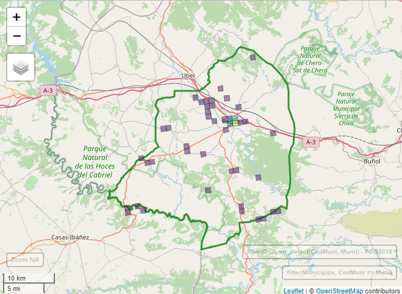
```

---

## En realidad, en el **centroide** de las `r icons::ionicons("square-outline")`

```{r, echo = FALSE, eval = TRUE, fig.asp = 2/2, out.width = "75%", fig.align = "center"}
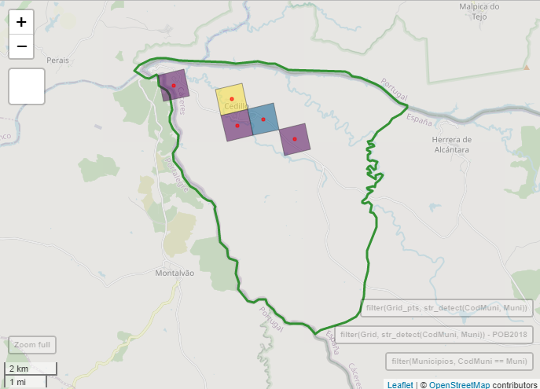
```

---

## ¿Disponemos de esa información? Digamos que si...

```{r, echo = FALSE, eval = TRUE, fig.asp = 2/2, out.width = "75%", fig.align = "center"}
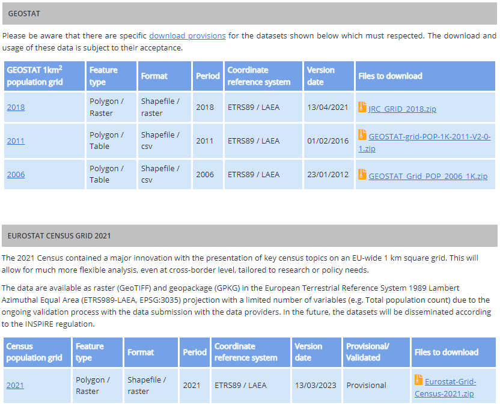
```

---

## Siempre podemos acotar la población en el espacio

```{r, echo = FALSE, eval = TRUE, fig.asp = 1/2, out.width = "1000%", fig.align = "center"}
knitr::include_url("./img/Wally.html")
```

---

## ¿Como vamos de un sitio a otro? ¡Por la **red**!

```{r echo = FALSE, out.width = "100%", fig.height = 6, eval = require("leaflet")}
route <- osrm::osrmRoute(src = c(-0.3559, 39.4805), dst = Oficinas[188, ], returnclass = "sf", osrm.profile = "foot")
leaflet() %>% addTiles() %>% setView(lng = -0.3594, lat = 39.4805, zoom = 16) %>%
  addMarkers(lng = -0.3559, lat = 39.4805, icon = IvieIcon) %>%
  addMarkers(data = Oficinas, clusterOptions = markerClusterOptions(), popup = Oficinas$Entidad) %>%
  addPolylines(data = route, color = "red") %>%
  addLabelOnlyMarkers(lng = -0.3587, lat = 39.4807, label = "1km & 12m", labelOptions = labelOptions(noHide = TRUE,
                      textOnly = TRUE, style = list("color" = "red"), textsize = "12px"))
```

---

# Algunas sutilezas (1/2)

Para cada **origen** —_celda_— debemos calcular las **rutas** óptimas —_distancia y tiempo de viaje_— para todos, o al menos muchos, **destinos** —_centros de servicio_—.

¿Cual es la dimensión de nuestro problema?

--

**Origenes:** 75 000 celdas con población.

**Destinos:** 500 hospitales.

La matriz de **O**rigen-**D**estino (OD) tiene 37 500 000 celdas a rellenar.

¿Es asumible? **Si**, ¡de forma exhaustiva!

--

.red[**Origenes:** 75 000 celdas con población.

**Destinos:** 22 000 oficinas bancarias.

La matriz de **O**rigen-**D**estino (OD) tiene 1 650 000 000 celdas a rellenar.

¿Es asumible? **No** de forma exhaustiva, pero **si** acotando el problema.]

---

## Si tienes interés en las tripas de la [tecnología](https://go.uv.es/goerlich/RoutingGrid)...

```{r, echo = FALSE, eval = TRUE, fig.asp = 2/2, out.width = "100%", fig.align = "center"}
knitr::include_url("https://go.uv.es/goerlich/RoutingGrid")
```

---

# Algunas sutilezas (2/2)

Los **cálculos** se realizan a **nivel de celda** y **centro de servicio**.

La [tecnología](https://go.uv.es/goerlich/RoutingGrid) permite generar lo que podemos denominar una **base de microdatos de accesibilidad**.

Resultados a nivel de área administrativa —_municipios o provincias_— requieren un mecanismo de agregación —_medias ponderadas_—.

Así, incluso cuando los cálculos no son exhaustivos, podemos responder a preguntas más allá de cual es el tiempo/distacia mínimas en las que la población de una determinada área alcanza un centro de servicio concreto.

Por ejemplo,

* Número medio de centros de servicio accesibles en _t_ minutos de tiempo.

* Población que tiene acceso a _n_ centros de servicio en _t_ minutos de tiempo.

* Población cubierta en _t_ minutos de tiempo por un centro de servicio concreto.

Naturalmente, podemos agregar a cualquier área geográfica.

---

class: inverse, center, middle

## Examinemos una gran foto de la accesibilidad a Servicios Sanitarios, Educativos y de Oficinas Bancarias.

---

## Servicios Sanitarios: Hospitales `r icons::icon_style(icons::fontawesome("hospital"), fill = "blue")`

.bg-washed-green.b--dark-green.ba.bw2.br3.shadow-5.ph4.mt4[

- El 55% de la población reside en un municipio que dispone de hospital. ¡Todas las islas tienen hospital!

- La distancia promedio al hospital más cercano es de 11 km con un tiempo de viaje promedio de 12 minutos.

- Algo más de 1 millón de personas —el 2.8% de la población— tienen que invertir más de 45 minutos para llegar al hospital más cercano.

- La geografía de las zonas con peor accesibilidad está claramente delimitada. Se trata de áreas montañosas, en ocasiones con comunicaciones difíciles. También algunas áreas en las periferias provinciales —Guadalajara, Cuenca, Teruel, Badajoz o Huesca—, alejadas de la capital. ¡Esta geografía se repite sistemáticamente!

- Las cifras agregadas esconden una gran heterogeneidad, tanto a nivel regional como en la dicotomía rural/urbano.

]

???

**Áreas montañosas con comunicaciones difíciles**: Picos de Europa, zonas del Pirineo, la Serranía de Cuenca, Montes de León, la Serranía de Gredos, la Sierra de Alcaraz y la vertiente sur de Sierra Nevada.

---

### .center[Tiempo de viaje al hospital más cercano]

```{r, echo = FALSE, eval = TRUE, fig.asp = 2/2, out.width = "87%", fig.align = "center"}
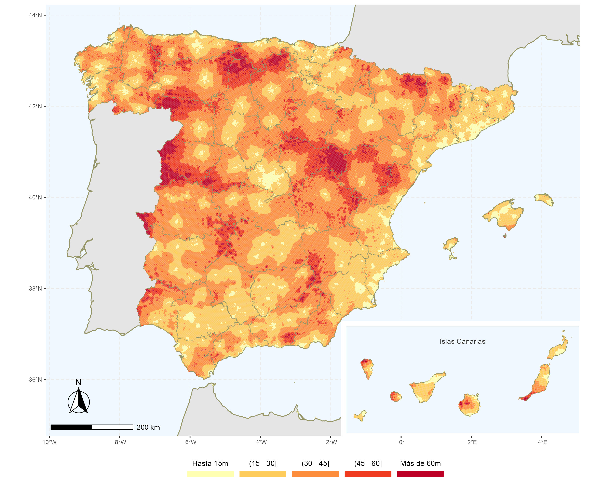
```

???

Comentar las zonas con peor acceso. Los efectos frontera y el efecto de la lejanía de la capital.

---

### .center[**Distancia (km)** al hospital más cercano]

```{r, echo = FALSE, eval = TRUE, fig.asp = 2/2.1, out.width = "70%", fig.align = "center"}
dataH <- readxl::read_xlsx("./data/PEE_Accesibilidad.xlsx", sheet = "Cuadro 2", range = "A4:F10") %>%
  select(-2) %>%
  rename(`Grado de Urbanización` = 1, Distancia = 2, Tiempo = 3, Accesibles = 4, PobSIN = 5) %>%
  mutate(`Grado de Urbanización` = c("Urbano", "Intermedio", "Categoría Urbana", "Rural", "Rural Próximo", "Rural Remoto"))

select(dataH, `Grado de Urbanización`, Distancia) %>%
  mutate(Distancia = round(Distancia, 1),
         `Grado de Urbanización` = factor(`Grado de Urbanización`, levels = c('Urbano', 'Intermedio', 'Categoría Urbana', 'Rural', 'Rural Próximo', 'Rural Remoto')),
         DEGURBA = c('D1', 'D1', 'D2', 'D1', 'D2', 'D2')) %>%
    ggplot(aes(x = `Grado de Urbanización`, y = Distancia, fill = DEGURBA)) +
    geom_bar(stat = "identity", position = position_dodge()) +
    geom_text(aes(label = format(Distancia, decimal.mark = '.')), vjust = 1.5, color = "white", size = 4) +
    xlab("") + ylab("") +
    ggtitle("Media Nacional = 10.9km") +
    scale_fill_manual(values = c("darkblue", "darkred")) +
    #theme_minimal() +
    theme(legend.position = "none", axis.text.y = element_blank(), axis.ticks.y = element_blank(), legend.title = element_blank())
```

---

### .center[**Tiempo de viaje (m)** al hospital más cercano]

```{r, echo = FALSE, eval = TRUE, fig.asp = 2/2.1, out.width = "70%", fig.align = "center"}
select(dataH, `Grado de Urbanización`, Tiempo) %>%
  mutate(Tiempo = round(Tiempo, 1),
         `Grado de Urbanización` = factor(`Grado de Urbanización`, levels = c('Urbano', 'Intermedio', 'Categoría Urbana', 'Rural', 'Rural Próximo', 'Rural Remoto')),
         DEGURBA = c('D1', 'D1', 'D2', 'D1', 'D2', 'D2')) %>%
    ggplot(aes(x = `Grado de Urbanización`, y = Tiempo, fill = DEGURBA)) +
    geom_bar(stat = "identity", position = position_dodge()) +
    geom_text(aes(label = format(Tiempo, decimal.mark = '.')), vjust = 1.5, color = "white", size = 4) +
    xlab("") + ylab("") +
    ggtitle("Media Nacional = 12.3m") +
    scale_fill_manual(values = c("darkblue", "darkred")) +
    #theme_minimal() +
    theme(legend.position = "none", axis.text.y = element_blank(), axis.ticks.y = element_blank(), legend.title = element_blank())
```

---

### .center[**Hospitales accesibles** en 45 minutos]

```{r, echo = FALSE, eval = TRUE, fig.asp = 2/2.1, out.width = "70%", fig.align = "center"}
select(dataH, `Grado de Urbanización`, Accesibles) %>%
  mutate(Accesibles = round(Accesibles, 1),
         `Grado de Urbanización` = factor(`Grado de Urbanización`, levels = c('Urbano', 'Intermedio', 'Categoría Urbana', 'Rural', 'Rural Próximo', 'Rural Remoto')),
         DEGURBA = c('D1', 'D1', 'D2', 'D1', 'D2', 'D2')) %>%
    ggplot(aes(x = `Grado de Urbanización`, y = Accesibles, fill = DEGURBA)) +
    geom_bar(stat = "identity", position = position_dodge()) +
    geom_text(aes(label = format(Accesibles, decimal.mark = '.')), vjust = 1.5, color = "white", size = 4) +
    xlab("") + ylab("") +
    ggtitle("Media Nacional = 16.4") +
    scale_fill_manual(values = c("darkblue", "darkred")) +
    #theme_minimal() +
    theme(legend.position = "none", axis.text.y = element_blank(), axis.ticks.y = element_blank(), legend.title = element_blank())
```

---

### .center[**Población (%) sin acceso** a un hospital en 15 minutos]

```{r, echo = FALSE, eval = TRUE, fig.asp = 2/2.1, out.width = "70%", fig.align = "center"}
select(dataH, `Grado de Urbanización`, PobSIN) %>%
  mutate(PobSIN = round(PobSIN, 1),
         `Grado de Urbanización` = factor(`Grado de Urbanización`, levels = c('Urbano', 'Intermedio', 'Categoría Urbana', 'Rural', 'Rural Próximo', 'Rural Remoto')),
         DEGURBA = c('D1', 'D1', 'D2', 'D1', 'D2', 'D2')) %>%
    ggplot(aes(x = `Grado de Urbanización`, y = PobSIN, fill = DEGURBA)) +
    geom_bar(stat = "identity", position = position_dodge()) +
    geom_text(aes(label = format(PobSIN, decimal.mark = '.')), vjust = 1.5, color = "white", size = 4) +
    xlab("") + ylab("") +
    ggtitle("Media Nacional = 2.8%") +
    scale_fill_manual(values = c("darkblue", "darkred")) +
    #theme_minimal() +
    theme(legend.position = "none", axis.text.y = element_blank(), axis.ticks.y = element_blank(), legend.title = element_blank())
```

---

## Servicios Sanitarios: Centros de Atención Primaria `r icons::icon_style(icons::fontawesome("hospital"), fill = "blue")`

.bg-washed-green.b--dark-green.ba.bw2.br3.shadow-5.ph4.mt4[

- Centros de Atención Primaria (CAP): presentes en la casi totalidad de los municipios. Solo unos 200 municipios carecen de ellos.

- La mayoría de los CAP, unos 10.000, son Consultorios Locales con una atención muy limitada y normalmente discontinua. El pilar básico son los Centros de Salud (CS), algo más de 3.000.

- Los CS están presentes en el 33% de los municipios que engloban al 88% de la población —a nivel municipal—.

- A nivel agregado —promedio nacional— el tiempo de acceso al CS más cercano no llega a los 5 minutos. 

- El 96% de la población tiene acceso a un CS en un tiempo de viaje que no supera los 15 minutos, y solo el 4% de la población debe desplazarse un tiempo mayor.

- Lo que no es evidente de estos números es el gradiente positivo entre tiempo de viaje y el envejecimiento de la población afectada.

]

???

Los municipios con peor accesibilidad son, en su mayoría, municipios de montaña, con una altitud media elevada, por encima de los 800m, previsiblemente con peores redes de comunicación, lo que a su vez incide negativamente sobre los tiempos de viaje y el número de centros de servicio a los que pueden acceder, y al mismo tiempo con una renta por hogar notablemente más baja que el promedio nacional. Son, pues, factores indicativos de la penalización adicional de unos pocos municipios rurales remotos, y es que la orografía juega un papel relevante en las cuestiones de accesibilidad y España presenta una [orografía complicada](https://go.uv.es/goerlich/Rugosidad).

A nivel regional existen importantes diferencias en cuanto a cobertura, lo que se debe fundamentalmente a dos factores. A la propia demografía, muy dispar entre comunidades autónomas, y a las diferentes formas de organizar la prestación de servicios sanitarios de las distintas comunidades en uso de sus atribuciones. Así, las provincias con mayor población sin centro de salud en su municipio son León, Zamora, Salamanca, Ávila y Segovia en Castilla y León, Badajoz, Toledo, Teruel y Lleida. Si consideramos la población de 65 años y más debemos añadir Burgos, Soria, Guadalajara, Cuenca y Huesca.

Este mapa muestra, por un lado, la existencia de patrones autonómicos claramente diferenciados, como es el caso de Galicia, donde solo dos municipios carecen de centro de salud, pero también permite apreciar diferencias en el porcentaje de población sin centro de salud en el municipio de residencia en provincias pertenecientes a una misma comunidad, como es el caso de Cataluña, Castilla y León, Andalucía, Aragón y Castilla-La Mancha.

En el caso de Cataluña, destaca la provincia de Lleida, con más de un 30% de la población sin centro de salud en su municipio de residencia (un 38,2% si se toma como referencia la población con 65 y más años) frente a Barcelona, donde este porcentaje desciende al 5,7% (5,3% en la población mayor). En Castilla y León, las diferencias entre provincias en el porcentaje de población que no tienen centro de salud en el municipio de residencia van desde porcentajes superiores al 30% en las provincias de Zamora, Segovia, Ávila, León y Salamanca (llegando a superar incluso el 40% en las dos primeras y el 50% en la primera cuando se considera la población mayor) hasta Valladolid, donde la población sin centro de salud representa el 18,5% de la población de la provincia.
Otro ejemplo de diferencias importantes en la dotación de centros de salud se observa en Castilla-La Mancha. Mientras en la provincia de Toledo el 38,3% de la población no dispone de centro de salud en su municipio (un 40,7% en el caso de la población mayor), en Albacete este porcentaje apenas alcanza el 13% (el 18,3% en la población mayor). También hay diferencias sustanciales en las provincias de Andalucía —desde el casi 30% en Granada hasta el 5,2% de Cádiz— y Aragón —desde el 30,1% de Teruel hasta el 13,5% de Zaragoza—.

---

### .center[**Distancia (km)** al Centro de Salud más cercano]

```{r, echo = FALSE, eval = TRUE, fig.asp = 2/2.1, out.width = "70%", fig.align = "center"}
dataCS <- readxl::read_xlsx("./data/PEE_Accesibilidad.xlsx", sheet = "Cuadro 3", range = "A4:F10") %>%
  select(-2) %>%
  rename(`Grado de Urbanización` = 1, Distancia = 2, Tiempo = 3, Accesibles = 4, PobSIN = 5) %>%
  mutate(`Grado de Urbanización` = c("Urbano", "Intermedio", "Categoría Urbana", "Rural", "Rural Próximo", "Rural Remoto"))

select(dataCS, `Grado de Urbanización`, Distancia) %>%
  mutate(Distancia = round(Distancia, 1),
         `Grado de Urbanización` = factor(`Grado de Urbanización`, levels = c('Urbano', 'Intermedio', 'Categoría Urbana', 'Rural', 'Rural Próximo', 'Rural Remoto')),
         DEGURBA = c('D1', 'D1', 'D2', 'D1', 'D2', 'D2')) %>%
    ggplot(aes(x = `Grado de Urbanización`, y = Distancia, fill = DEGURBA)) +
    geom_bar(stat = "identity", position = position_dodge()) +
    geom_text(aes(label = format(Distancia, decimal.mark = '.')), vjust = 1.5, color = "white", size = 4) +
    xlab("") + ylab("") +
    ggtitle("Media Nacional = 2.7km") +
    scale_fill_manual(values = c("darkblue", "darkred")) +
    #theme_minimal() +
    theme(legend.position = "none", axis.text.y = element_blank(), axis.ticks.y = element_blank(), legend.title = element_blank())
```

---

### .center[**Tiempo de viaje (m)** al Centro de Salud más cercano]

```{r, echo = FALSE, eval = TRUE, fig.asp = 2/2.1, out.width = "70%", fig.align = "center"}
select(dataCS, `Grado de Urbanización`, Tiempo) %>%
  mutate(Tiempo = round(Tiempo, 1),
         `Grado de Urbanización` = factor(`Grado de Urbanización`, levels = c('Urbano', 'Intermedio', 'Categoría Urbana', 'Rural', 'Rural Próximo', 'Rural Remoto')),
         DEGURBA = c('D1', 'D1', 'D2', 'D1', 'D2', 'D2')) %>%
    ggplot(aes(x = `Grado de Urbanización`, y = Tiempo, fill = DEGURBA)) +
    geom_bar(stat = "identity", position = position_dodge()) +
    geom_text(aes(label = format(Tiempo, decimal.mark = '.')), vjust = 1.5, color = "white", size = 4) +
    xlab("") + ylab("") +
    ggtitle("Media Nacional = 4.2m") +
    scale_fill_manual(values = c("darkblue", "darkred")) +
    #theme_minimal() +
    theme(legend.position = "none", axis.text.y = element_blank(), axis.ticks.y = element_blank(), legend.title = element_blank())
```

---

### .center[**Centros de Salud accesibles** en 15 minutos]

```{r, echo = FALSE, eval = TRUE, fig.asp = 2/2.1, out.width = "70%", fig.align = "center"}
select(dataCS, `Grado de Urbanización`, Accesibles) %>%
  mutate(Accesibles = round(Accesibles, 1),
         `Grado de Urbanización` = factor(`Grado de Urbanización`, levels = c('Urbano', 'Intermedio', 'Categoría Urbana', 'Rural', 'Rural Próximo', 'Rural Remoto')),
         DEGURBA = c('D1', 'D1', 'D2', 'D1', 'D2', 'D2')) %>%
    ggplot(aes(x = `Grado de Urbanización`, y = Accesibles, fill = DEGURBA)) +
    geom_bar(stat = "identity", position = position_dodge()) +
    geom_text(aes(label = format(Accesibles, decimal.mark = '.')), vjust = 1.5, color = "white", size = 4) +
    xlab("") + ylab("") +
    ggtitle("Media Nacional = 20.0") +
    scale_fill_manual(values = c("darkblue", "darkred")) +
    #theme_minimal() +
    theme(legend.position = "none", axis.text.y = element_blank(), axis.ticks.y = element_blank(), legend.title = element_blank())
```

---

### .center[**Población (%) sin acceso** a un Centro de Salud en 15 minutos]

```{r, echo = FALSE, eval = TRUE, fig.asp = 2/2.1, out.width = "70%", fig.align = "center"}
select(dataCS, `Grado de Urbanización`, PobSIN) %>%
  mutate(PobSIN = round(PobSIN, 1),
         `Grado de Urbanización` = factor(`Grado de Urbanización`, levels = c('Urbano', 'Intermedio', 'Categoría Urbana', 'Rural', 'Rural Próximo', 'Rural Remoto')),
         DEGURBA = c('D1', 'D1', 'D2', 'D1', 'D2', 'D2')) %>%
    ggplot(aes(x = `Grado de Urbanización`, y = PobSIN, fill = DEGURBA)) +
    geom_bar(stat = "identity", position = position_dodge()) +
    geom_text(aes(label = format(PobSIN, decimal.mark = '.')), vjust = 1.5, color = "white", size = 4) +
    xlab("") + ylab("") +
    ggtitle("Media Nacional = 3.9%") +
    scale_fill_manual(values = c("darkblue", "darkred")) +
    #theme_minimal() +
    theme(legend.position = "none", axis.text.y = element_blank(), axis.ticks.y = element_blank(), legend.title = element_blank())
```

---

## Servicios Educativos: **¡Algunos números!**

Al contrario que la Sanidad la Educación no se provee a toda la población.

--

- En casi 700 municipios no existe población entre los 3 y los 11 años.

- ¡Y en casi 3.000 municipios la población en esta franja de edad no supera los 20 alumnos!

--

- En casi 1.000 municipios no existe población entre los 12 y los 15 años. 

- ¡En unos 3.500 municipios la población en esta franja de edad no supera los 20 alumnos!

--

- En más de 1.300 municipios no existe población entre los 16 y los 17 años.

- ¡Y en casi 4.000 municipios la población en esta franja de edad no supera los 20 alumnos!

**Estas cifras permiten entender lo difícil que es prestar un servicio esencial con esta estructura demográfica y de asentamientos.**

???

Cifras del Padrón de 2019.

**Educación Secundaria**: Todos ellos rurales, la mayoría de montaña —con una altitud media de 922m— y con una población que en ningún caso supera los 400 habitantes.

**Educación de Bachillerato**: Todos ellos rurales, la mayoría de montaña —con una altitud media de 902m— y con una población que en ningún caso supera los 800 habitantes. Más de la mitad de estos municipios se localizan en Castilla y León, lo que representa un tercio de sus municipios.

**Nota metodológica**: Los resultados cuantitativos acerca de la accesibilidad deben acotarse a la población a la que hay que prestar el servicio. Sin embargo, no disponemos de población en formato de grid por franjas de edad. Como aproximación simplemente se escaló la población de las celdas de cada municipio por la proporción de población del municipio en la franja de edad correspondiente. El supuesto implícito es que la distribución de la población por edades es uniforme espacialmente dentro del municipio. Creemos que este es un supuesto más razonable que efectuar los cálculos para toda la población, cuando los receptores del servicio son una parte pequeña de la misma. Esta forma de proceder elimina del análisis aquellos municipios que no tienen población escolar en la franja correspondiente.

---

## Servicios Educativos: Centros de Bachillerato `r icons::icon_style(icons::fontawesome("school"), fill = "blue")`

.bg-washed-green.b--dark-green.ba.bw2.br3.shadow-5.ph4.mt4[

- El 79% de los municipios no dispone de Centro de Bachillerato.

- Sin embargo, a nivel agregado, solo un 2% de la población entre los 16 y los 17 años no tiene acceso a un centro de bachillerato en 20 minutos de tiempo de viaje, lo que supone una población inferior a los 20.000 estudiantes potenciales.

- Estas cifras se reducen considerablemente si aumentamos el umbral a los 30 minutos.

- La distancia y el tiempo medio de acceso para el conjunto nacional no llega a los 3 km de distancia y los 5 minutos de tiempo de viaje respectivamente.

- Pero, al igual que sucede con la sanidad, las discrepancias entre el mundo urbano y rural son considerables.

]

???

Las diferencias en la dotación de centros son notables cuando se considera la provincia como unidad territorial. A diferencia de los niveles de enseñanza básica y obligatoria, una mayor parte de la población de referencia debe desplazarse a otro municipio para atender este nivel de enseñanza, como resulta natural. Como se observa en el mapa, en una parte importante de las provincias españolas este porcentaje es superior al 20%, es decir, más de una quinta parte de la población con edad entre 16 y 17 años deben desplazarse a otro municipio si quieren recibir enseñanzas de bachillerato. La concentración geográfica de estas provincias simplemente intensifica las de anteriores niveles educativos, localizándose en el interior y norte peninsular, y superándose el 30% en 9 provincias, 4 de ellas de Castilla y León —Palencia, Salamanca, Segovia y Zamora—, además de Cáceres, Cuenca, Toledo, Teruel y Navarra. Únicamente en Murcia este porcentaje es inferior al 1%, seguida de Asturias, Madrid, Alicante, Cádiz y Las Palmas, con porcentajes inferiores al 5%. Asimismo, se observan diferencias importantes incluso dentro de algunas comunidades, como es el caso de Andalucía, Cataluña o Galicia.

---

### .center[**Distancia (km)** al Centro de Bachillerato más cercano]

```{r, echo = FALSE, eval = TRUE, fig.asp = 2/2.1, out.width = "70%", fig.align = "center"}
dataBH <- readxl::read_xlsx("./data/PEE_Accesibilidad.xlsx", sheet = "Cuadro 4", range = "A4:F10") %>%
  select(-2) %>%
  rename(`Grado de Urbanización` = 1, Distancia = 2, Tiempo = 3, Accesibles = 4, PobSIN = 5) %>%
  mutate(`Grado de Urbanización` = c("Urbano", "Intermedio", "Categoría Urbana", "Rural", "Rural Próximo", "Rural Remoto"))

select(dataBH, `Grado de Urbanización`, Distancia) %>%
  mutate(Distancia = round(Distancia, 1),
         `Grado de Urbanización` = factor(`Grado de Urbanización`, levels = c('Urbano', 'Intermedio', 'Categoría Urbana', 'Rural', 'Rural Próximo', 'Rural Remoto')),
         DEGURBA = c('D1', 'D1', 'D2', 'D1', 'D2', 'D2')) %>%
    ggplot(aes(x = `Grado de Urbanización`, y = Distancia, fill = DEGURBA)) +
    geom_bar(stat = "identity", position = position_dodge()) +
    geom_text(aes(label = format(Distancia, decimal.mark = '.')), vjust = 1.5, color = "white", size = 4) +
    xlab("") + ylab("") +
    ggtitle("Media Nacional = 2.7km") +
    scale_fill_manual(values = c("darkblue", "darkred")) +
    #theme_minimal() +
    theme(legend.position = "none", axis.text.y = element_blank(), axis.ticks.y = element_blank(), legend.title = element_blank())
```

---

### .center[**Tiempo de viaje (m)** al Centro de Bachillerato más cercano]

```{r, echo = FALSE, eval = TRUE, fig.asp = 2/2.1, out.width = "70%", fig.align = "center"}
select(dataBH, `Grado de Urbanización`, Tiempo) %>%
  mutate(Tiempo = round(Tiempo, 1),
         `Grado de Urbanización` = factor(`Grado de Urbanización`, levels = c('Urbano', 'Intermedio', 'Categoría Urbana', 'Rural', 'Rural Próximo', 'Rural Remoto')),
         DEGURBA = c('D1', 'D1', 'D2', 'D1', 'D2', 'D2')) %>%
    ggplot(aes(x = `Grado de Urbanización`, y = Tiempo, fill = DEGURBA)) +
    geom_bar(stat = "identity", position = position_dodge()) +
    geom_text(aes(label = format(Tiempo, decimal.mark = '.')), vjust = 1.5, color = "white", size = 4) +
    xlab("") + ylab("") +
    ggtitle("Media Nacional = 4.1m") +
    scale_fill_manual(values = c("darkblue", "darkred")) +
    #theme_minimal() +
    theme(legend.position = "none", axis.text.y = element_blank(), axis.ticks.y = element_blank(), legend.title = element_blank())
```

---

### .center[**Centros de Bachillerato accesibles** en 20 minutos]

```{r, echo = FALSE, eval = TRUE, fig.asp = 2/2.1, out.width = "70%", fig.align = "center"}
select(dataBH, `Grado de Urbanización`, Accesibles) %>%
  mutate(Accesibles = round(Accesibles, 1),
         `Grado de Urbanización` = factor(`Grado de Urbanización`, levels = c('Urbano', 'Intermedio', 'Categoría Urbana', 'Rural', 'Rural Próximo', 'Rural Remoto')),
         DEGURBA = c('D1', 'D1', 'D2', 'D1', 'D2', 'D2')) %>%
    ggplot(aes(x = `Grado de Urbanización`, y = Accesibles, fill = DEGURBA)) +
    geom_bar(stat = "identity", position = position_dodge()) +
    geom_text(aes(label = format(Accesibles, decimal.mark = '.')), vjust = 1.5, color = "white", size = 4) +
    xlab("") + ylab("") +
    ggtitle("Media Nacional = 40.5") +
    scale_fill_manual(values = c("darkblue", "darkred")) +
    #theme_minimal() +
    theme(legend.position = "none", axis.text.y = element_blank(), axis.ticks.y = element_blank(), legend.title = element_blank())
```

---

### .center[**Población (%) sin acceso** a un Centro de Bachillerato en 20 minutos]

```{r, echo = FALSE, eval = TRUE, fig.asp = 2/2.1, out.width = "70%", fig.align = "center"}
select(dataBH, `Grado de Urbanización`, PobSIN) %>%
  mutate(PobSIN = round(PobSIN, 1),
         `Grado de Urbanización` = factor(`Grado de Urbanización`, levels = c('Urbano', 'Intermedio', 'Categoría Urbana', 'Rural', 'Rural Próximo', 'Rural Remoto')),
         DEGURBA = c('D1', 'D1', 'D2', 'D1', 'D2', 'D2')) %>%
    ggplot(aes(x = `Grado de Urbanización`, y = PobSIN, fill = DEGURBA)) +
    geom_bar(stat = "identity", position = position_dodge()) +
    geom_text(aes(label = format(PobSIN, decimal.mark = '.')), vjust = 1.5, color = "white", size = 4) +
    xlab("") + ylab("") +
    ggtitle("Media Nacional = 2.0%") +
    scale_fill_manual(values = c("darkblue", "darkred")) +
    #theme_minimal() +
    theme(legend.position = "none", axis.text.y = element_blank(), axis.ticks.y = element_blank(), legend.title = element_blank())
```

---

## Servicios Educativos: Centros de Secundaria `r icons::icon_style(icons::fontawesome("school"), fill = "blue")`

.bg-washed-green.b--dark-green.ba.bw2.br3.shadow-5.ph4.mt4[

- El 70% de los municipios no dispone de Centro de Educación Secundaria Obligatoria.

- Para el conjunto nacional, los tiempos de acceso son muy reducidos, y estos solo son ligeramente significativos en los municipios rurales, no existen en este caso grandes diferencias entre los próximos a una gran ciudad y los remotos.

- En cualquier caso, los tiempos medios de acceso de cualquiera de las tipologías consideradas nunca superan los 10 minutos.

- Solo algo menos de 15,000 alumnos no tienen un centro de ESO accesible a menos de 15 minutos.

- La cobertura es prácticamente completa en el mundo urbano, donde el número de centros accesibles es notablemente mayor, es decir, hay mucha más variedad.

]

---

### .center[**Distancia (km)** al Centro de ESO más cercano]

```{r, echo = FALSE, eval = TRUE, fig.asp = 2/2.1, out.width = "70%", fig.align = "center"}
dataESO <- readxl::read_xlsx("./data/PEE_Accesibilidad.xlsx", sheet = "Cuadro 5", range = "A4:F10") %>%
  select(-2) %>%
  rename(`Grado de Urbanización` = 1, Distancia = 2, Tiempo = 3, Accesibles = 4, PobSIN = 5) %>%
  mutate(`Grado de Urbanización` = c("Urbano", "Intermedio", "Categoría Urbana", "Rural", "Rural Próximo", "Rural Remoto"))

select(dataESO, `Grado de Urbanización`, Distancia) %>%
  mutate(Distancia = round(Distancia, 1),
         `Grado de Urbanización` = factor(`Grado de Urbanización`, levels = c('Urbano', 'Intermedio', 'Categoría Urbana', 'Rural', 'Rural Próximo', 'Rural Remoto')),
         DEGURBA = c('D1', 'D1', 'D2', 'D1', 'D2', 'D2')) %>%
    ggplot(aes(x = `Grado de Urbanización`, y = Distancia, fill = DEGURBA)) +
    geom_bar(stat = "identity", position = position_dodge()) +
    geom_text(aes(label = format(Distancia, decimal.mark = '.')), vjust = 1.5, color = "white", size = 4) +
    xlab("") + ylab("") +
    ggtitle("Media Nacional = 1.9km") +
    scale_fill_manual(values = c("darkblue", "darkred")) +
    #theme_minimal() +
    theme(legend.position = "none", axis.text.y = element_blank(), axis.ticks.y = element_blank(), legend.title = element_blank())
```

---

### .center[**Tiempo de viaje (m)** al Centro de ESO más cercano]

```{r, echo = FALSE, eval = TRUE, fig.asp = 2/2.1, out.width = "70%", fig.align = "center"}
select(dataESO, `Grado de Urbanización`, Tiempo) %>%
  mutate(Tiempo = round(Tiempo, 1),
         `Grado de Urbanización` = factor(`Grado de Urbanización`, levels = c('Urbano', 'Intermedio', 'Categoría Urbana', 'Rural', 'Rural Próximo', 'Rural Remoto')),
         DEGURBA = c('D1', 'D1', 'D2', 'D1', 'D2', 'D2')) %>%
    ggplot(aes(x = `Grado de Urbanización`, y = Tiempo, fill = DEGURBA)) +
    geom_bar(stat = "identity", position = position_dodge()) +
    geom_text(aes(label = format(Tiempo, decimal.mark = '.')), vjust = 1.5, color = "white", size = 4) +
    xlab("") + ylab("") +
    ggtitle("Media Nacional = 3.1m") +
    scale_fill_manual(values = c("darkblue", "darkred")) +
    #theme_minimal() +
    theme(legend.position = "none", axis.text.y = element_blank(), axis.ticks.y = element_blank(), legend.title = element_blank())
```

---

### .center[**Centros de ESO accesibles** en 15 minutos]

```{r, echo = FALSE, eval = TRUE, fig.asp = 2/2.1, out.width = "70%", fig.align = "center"}
select(dataESO, `Grado de Urbanización`, Accesibles) %>%
  mutate(Accesibles = round(Accesibles, 1),
         `Grado de Urbanización` = factor(`Grado de Urbanización`, levels = c('Urbano', 'Intermedio', 'Categoría Urbana', 'Rural', 'Rural Próximo', 'Rural Remoto')),
         DEGURBA = c('D1', 'D1', 'D2', 'D1', 'D2', 'D2')) %>%
    ggplot(aes(x = `Grado de Urbanización`, y = Accesibles, fill = DEGURBA)) +
    geom_bar(stat = "identity", position = position_dodge()) +
    geom_text(aes(label = format(Accesibles, decimal.mark = '.')), vjust = 1.5, color = "white", size = 4) +
    xlab("") + ylab("") +
    ggtitle("Media Nacional = 54.3") +
    scale_fill_manual(values = c("darkblue", "darkred")) +
    #theme_minimal() +
    theme(legend.position = "none", axis.text.y = element_blank(), axis.ticks.y = element_blank(), legend.title = element_blank())
```

---

### .center[**Población (%) sin acceso** a un Centro de ESO en 15 minutos]

```{r, echo = FALSE, eval = TRUE, fig.asp = 2/2.1, out.width = "70%", fig.align = "center"}
select(dataESO, `Grado de Urbanización`, PobSIN) %>%
  mutate(PobSIN = round(PobSIN, 1),
         `Grado de Urbanización` = factor(`Grado de Urbanización`, levels = c('Urbano', 'Intermedio', 'Categoría Urbana', 'Rural', 'Rural Próximo', 'Rural Remoto')),
         DEGURBA = c('D1', 'D1', 'D2', 'D1', 'D2', 'D2')) %>%
    ggplot(aes(x = `Grado de Urbanización`, y = PobSIN, fill = DEGURBA)) +
    geom_bar(stat = "identity", position = position_dodge()) +
    geom_text(aes(label = format(PobSIN, decimal.mark = '.')), vjust = 1.5, color = "white", size = 4) +
    xlab("") + ylab("") +
    ggtitle("Media Nacional = 2.0%") +
    scale_fill_manual(values = c("darkblue", "darkred")) +
    #theme_minimal() +
    theme(legend.position = "none", axis.text.y = element_blank(), axis.ticks.y = element_blank(), legend.title = element_blank())
```

---

## Servicios Educativos: Centros de Primaria e Infantil Segundo Ciclo `r icons::icon_style(icons::fontawesome("school"), fill = "blue")`

.bg-washed-green.b--dark-green.ba.bw2.br3.shadow-5.ph4.mt4[

- En más de la mitad de municipios, el 56%, existen un centro de Educación Primaria.

- La educación primaria está muy extendida, aunque se sigue manteniendo un gradiente rural-urbano similar al que encontramos en etapas educativas posteriores, si bien ligeramente menos acusado.

- La heterogeneidad del alumnado —que comprende las edades entre los 3 y los 11 años—, además de su dispersión geográfica, complica notablemente la provisión del servicio.

- La educación privada está prácticamente ausente en el mundo rural.

]

---

### .center[**Distancia (km)** al Centro de Primaria e Infantil Segundo Ciclo más cercano]

```{r, echo = FALSE, eval = TRUE, fig.asp = 2/2.1, out.width = "70%", fig.align = "center"}
dataPRI <- readxl::read_xlsx("./data/PEE_Accesibilidad.xlsx", sheet = "Cuadro 6", range = "A4:F10") %>%
  select(-2) %>%
  rename(`Grado de Urbanización` = 1, Distancia = 2, Tiempo = 3, Accesibles = 4, PobSIN = 5) %>%
  mutate(`Grado de Urbanización` = c("Urbano", "Intermedio", "Categoría Urbana", "Rural", "Rural Próximo", "Rural Remoto"))

select(dataPRI, `Grado de Urbanización`, Distancia) %>%
  mutate(Distancia = round(Distancia, 1),
         `Grado de Urbanización` = factor(`Grado de Urbanización`, levels = c('Urbano', 'Intermedio', 'Categoría Urbana', 'Rural', 'Rural Próximo', 'Rural Remoto')),
         DEGURBA = c('D1', 'D1', 'D2', 'D1', 'D2', 'D2')) %>%
    ggplot(aes(x = `Grado de Urbanización`, y = Distancia, fill = DEGURBA)) +
    geom_bar(stat = "identity", position = position_dodge()) +
    geom_text(aes(label = format(Distancia, decimal.mark = '.')), vjust = 1.5, color = "white", size = 4) +
    xlab("") + ylab("") +
    ggtitle("Media Nacional = 1.1km") +
    scale_fill_manual(values = c("darkblue", "darkred")) +
    #theme_minimal() +
    theme(legend.position = "none", axis.text.y = element_blank(), axis.ticks.y = element_blank(), legend.title = element_blank())
```

---

### .center[**Tiempo de viaje (m)** al Centro de Primaria e Infantil Segundo Ciclo más cercano]

```{r, echo = FALSE, eval = TRUE, fig.asp = 2/2.1, out.width = "70%", fig.align = "center"}
select(dataPRI, `Grado de Urbanización`, Tiempo) %>%
  mutate(Tiempo = round(Tiempo, 1),
         `Grado de Urbanización` = factor(`Grado de Urbanización`, levels = c('Urbano', 'Intermedio', 'Categoría Urbana', 'Rural', 'Rural Próximo', 'Rural Remoto')),
         DEGURBA = c('D1', 'D1', 'D2', 'D1', 'D2', 'D2')) %>%
    ggplot(aes(x = `Grado de Urbanización`, y = Tiempo, fill = DEGURBA)) +
    geom_bar(stat = "identity", position = position_dodge()) +
    geom_text(aes(label = format(Tiempo, decimal.mark = '.')), vjust = 1.5, color = "white", size = 4) +
    xlab("") + ylab("") +
    ggtitle("Media Nacional = 2.1m") +
    scale_fill_manual(values = c("darkblue", "darkred")) +
    #theme_minimal() +
    theme(legend.position = "none", axis.text.y = element_blank(), axis.ticks.y = element_blank(), legend.title = element_blank())
```

---

### .center[**Centros de Primaria e Infantil Segundo Ciclo accesibles** en 10 minutos]

```{r, echo = FALSE, eval = TRUE, fig.asp = 2/2.1, out.width = "70%", fig.align = "center"}
select(dataPRI, `Grado de Urbanización`, Accesibles) %>%
  mutate(Accesibles = round(Accesibles, 1),
         `Grado de Urbanización` = factor(`Grado de Urbanización`, levels = c('Urbano', 'Intermedio', 'Categoría Urbana', 'Rural', 'Rural Próximo', 'Rural Remoto')),
         DEGURBA = c('D1', 'D1', 'D2', 'D1', 'D2', 'D2')) %>%
    ggplot(aes(x = `Grado de Urbanización`, y = Accesibles, fill = DEGURBA)) +
    geom_bar(stat = "identity", position = position_dodge()) +
    geom_text(aes(label = format(Accesibles, decimal.mark = '.')), vjust = 1.5, color = "white", size = 4) +
    xlab("") + ylab("") +
    ggtitle("Media Nacional = 45.2") +
    scale_fill_manual(values = c("darkblue", "darkred")) +
    #theme_minimal() +
    theme(legend.position = "none", axis.text.y = element_blank(), axis.ticks.y = element_blank(), legend.title = element_blank())
```

---

### .center[**Población (%) sin acceso** a un Centro de Primaria e Infantil Segundo Ciclo en 10 minutos]

```{r, echo = FALSE, eval = TRUE, fig.asp = 2/2.1, out.width = "70%", fig.align = "center"}
select(dataPRI, `Grado de Urbanización`, PobSIN) %>%
  mutate(PobSIN = round(PobSIN, 1),
         `Grado de Urbanización` = factor(`Grado de Urbanización`, levels = c('Urbano', 'Intermedio', 'Categoría Urbana', 'Rural', 'Rural Próximo', 'Rural Remoto')),
         DEGURBA = c('D1', 'D1', 'D2', 'D1', 'D2', 'D2')) %>%
    ggplot(aes(x = `Grado de Urbanización`, y = PobSIN, fill = DEGURBA)) +
    geom_bar(stat = "identity", position = position_dodge()) +
    geom_text(aes(label = format(PobSIN, decimal.mark = '.')), vjust = 1.5, color = "white", size = 4) +
    xlab("") + ylab("") +
    ggtitle("Media Nacional = 1.4%") +
    scale_fill_manual(values = c("darkblue", "darkred")) +
    #theme_minimal() +
    theme(legend.position = "none", axis.text.y = element_blank(), axis.ticks.y = element_blank(), legend.title = element_blank())
```

---

# ¿Son nuestras estimaciones razonables?

Es difícil encontrar estudios frente a los que comparar, pero **¡creemos que sí!**

.panelset[

.panel[.panel-name[Primaria]
```{r, echo = FALSE, eval = TRUE, fig.asp = 2/2, out.width = "75%", fig.align = "center"}
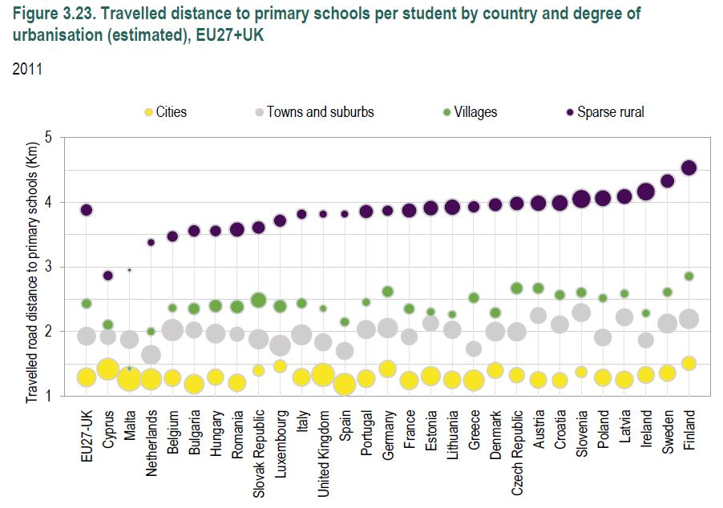
```
]

.panel[.panel-name[Secundaria]
```{r, echo = FALSE, eval = TRUE, fig.asp = 2/2, out.width = "75%", fig.align = "center"}
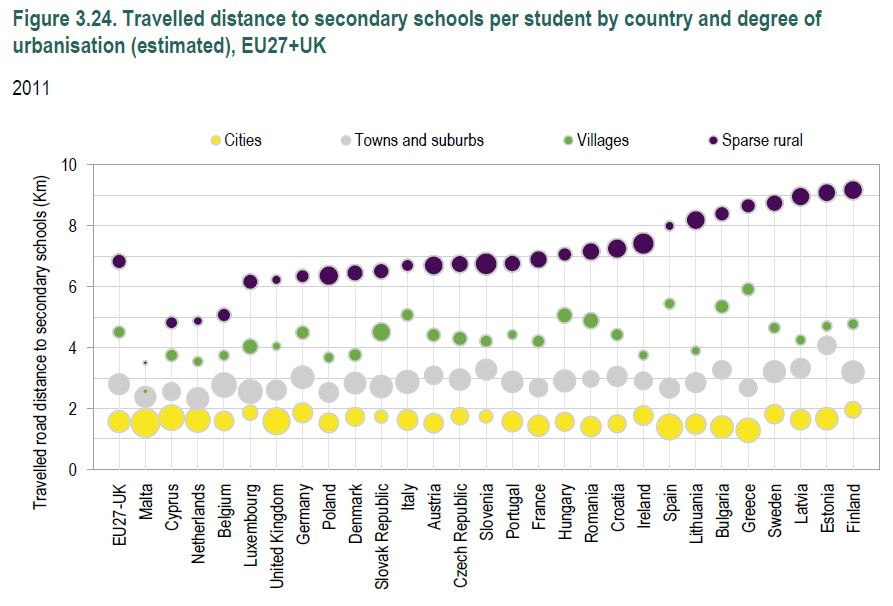
```
]

]

???

Datos de un estudio de la [OECD](https://www.oecd.org/publications/access-and-cost-of-education-and-health-services-4ab69cf3-en.htm)

**Primaria**: La máxima distancia se obtiene para el mundo rural, pero, para España, es de solo 4km.

**Secundaria**: La máxima distancia se obtiene para el mundo rural, pero, para España, es de solo 8km.

Son distancias reducidas. Obtenidas con metodologías diferentes, pero que indican que nuestras estimaciones son perfectamente razonables.

---

## Servicios Financieros: Oficinas Bancarias `r icons::icon_style(icons::ionicons("cash"), fill = "blue")`

.bg-washed-green.b--dark-green.ba.bw2.br3.shadow-5.ph4.mt4[

- La distancia media de acceso de la población rural a una oficina bancaria es de 3.2km, con un tiempo estimado de unos 5 minutos, frente a 1.0km y casi 2 minutos del mundo urbano.

- La población sin acceso a una oficina bancaria en 15 minutos es del 1.0% a nivel nacional, algo inferior al medio millón de personas, y se eleva al 8% para los municipios rurales remotos, unas 200,000 personas.

- ¡Hay más población sin un Centro de Salud accesible en 15 minutos, el 3.9%, que sin acceso a una oficina bancaria, el 1.0%!

- También es así en el mundo rural, donde la población sin acceso a un Centro de Salud en 15 minutos alcanza el 20.8%, mientras que sin acceso a una oficina bancaria solo llega al 5.2%.

- El mundo urbano se caracteriza por una enorme diversidad en los accesos, frente al mundo rural.

- Las diferencias provinciales son, de nuevo, muy importantes.

]

???

Las estimaciones de [PEE](https://www.funcas.es/revista/la-economia-espanola-ante-el-reto-demografico/) son acordes con las del Banco de España en su version de _work in progress_ de [_El Acceso a Servicios en la España Rural_](https://www.bde.es/f/webbde/SES/Secciones/Publicaciones/PublicacionesSeriadas/DocumentosOcasionales/21/Fich/do2122.pdf), en el que estiman que la distancia que deben recorrer los ciudadanos de un municipio sin oficina bancaria a la oficina más cercana es de 7km.

---

### .center[**Distancia (km)** a la Oficina Bancaria más cercana]

```{r, echo = FALSE, eval = TRUE, fig.asp = 2/2.1, out.width = "70%", fig.align = "center"}
dataOfi <- readxl::read_xlsx("./data/PEE_Accesibilidad.xlsx", sheet = "Cuadro 7", range = "A4:F10") %>%
  select(-2) %>%
  rename(`Grado de Urbanización` = 1, Distancia = 2, Tiempo = 3, Accesibles = 4, PobSIN = 5) %>%
  mutate(`Grado de Urbanización` = c("Urbano", "Intermedio", "Categoría Urbana", "Rural", "Rural Próximo", "Rural Remoto"))

select(dataOfi, `Grado de Urbanización`, Distancia) %>%
  mutate(Distancia = round(Distancia, 1),
         `Grado de Urbanización` = factor(`Grado de Urbanización`, levels = c('Urbano', 'Intermedio', 'Categoría Urbana', 'Rural', 'Rural Próximo', 'Rural Remoto')),
         DEGURBA = c('D1', 'D1', 'D2', 'D1', 'D2', 'D2')) %>%
    ggplot(aes(x = `Grado de Urbanización`, y = Distancia, fill = DEGURBA)) +
    geom_bar(stat = "identity", position = position_dodge()) +
    geom_text(aes(label = format(Distancia, decimal.mark = '.')), vjust = 1.5, color = "white", size = 4) +
    xlab("") + ylab("") +
    ggtitle("Media Nacional = 1.3km") +
    scale_fill_manual(values = c("darkblue", "darkred")) +
    #theme_minimal() +
    theme(legend.position = "none", axis.text.y = element_blank(), axis.ticks.y = element_blank(), legend.title = element_blank())
```

---

### .center[**Tiempo de viaje (m)** a la Oficina Bancaria más cercana]

```{r, echo = FALSE, eval = TRUE, fig.asp = 2/2.1, out.width = "70%", fig.align = "center"}
select(dataOfi, `Grado de Urbanización`, Tiempo) %>%
  mutate(Tiempo = round(Tiempo, 1),
         `Grado de Urbanización` = factor(`Grado de Urbanización`, levels = c('Urbano', 'Intermedio', 'Categoría Urbana', 'Rural', 'Rural Próximo', 'Rural Remoto')),
         DEGURBA = c('D1', 'D1', 'D2', 'D1', 'D2', 'D2')) %>%
    ggplot(aes(x = `Grado de Urbanización`, y = Tiempo, fill = DEGURBA)) +
    geom_bar(stat = "identity", position = position_dodge()) +
    geom_text(aes(label = format(Tiempo, decimal.mark = '.')), vjust = 1.5, color = "white", size = 4) +
    xlab("") + ylab("") +
    ggtitle("Media Nacional = 2.3m") +
    scale_fill_manual(values = c("darkblue", "darkred")) +
    #theme_minimal() +
    theme(legend.position = "none", axis.text.y = element_blank(), axis.ticks.y = element_blank(), legend.title = element_blank())
```

---

### .center[**Oficinas Bancarias accesibles** en 15 minutos]

```{r, echo = FALSE, eval = TRUE, fig.asp = 2/2.1, out.width = "70%", fig.align = "center"}
select(dataOfi, `Grado de Urbanización`, Accesibles) %>%
  mutate(Accesibles = round(Accesibles, 1),
         `Grado de Urbanización` = factor(`Grado de Urbanización`, levels = c('Urbano', 'Intermedio', 'Categoría Urbana', 'Rural', 'Rural Próximo', 'Rural Remoto')),
         DEGURBA = c('D1', 'D1', 'D2', 'D1', 'D2', 'D2')) %>%
    ggplot(aes(x = `Grado de Urbanización`, y = Accesibles, fill = DEGURBA)) +
    geom_bar(stat = "identity", position = position_dodge()) +
    geom_text(aes(label = format(Accesibles, decimal.mark = '.')), vjust = 1.5, color = "white", size = 4) +
    xlab("") + ylab("") +
    ggtitle("Media Nacional = 208.4") +
    scale_fill_manual(values = c("darkblue", "darkred")) +
    #theme_minimal() +
    theme(legend.position = "none", axis.text.y = element_blank(), axis.ticks.y = element_blank(), legend.title = element_blank())
```

---

### .center[**Población (%) sin acceso** a una Oficina Bancaria en 15 minutos]

```{r, echo = FALSE, eval = TRUE, fig.asp = 2/2.1, out.width = "70%", fig.align = "center"}
select(dataOfi, `Grado de Urbanización`, PobSIN) %>%
  mutate(PobSIN = round(PobSIN, 1),
         `Grado de Urbanización` = factor(`Grado de Urbanización`, levels = c('Urbano', 'Intermedio', 'Categoría Urbana', 'Rural', 'Rural Próximo', 'Rural Remoto')),
         DEGURBA = c('D1', 'D1', 'D2', 'D1', 'D2', 'D2')) %>%
    ggplot(aes(x = `Grado de Urbanización`, y = PobSIN, fill = DEGURBA)) +
    geom_bar(stat = "identity", position = position_dodge()) +
    geom_text(aes(label = format(PobSIN, decimal.mark = '.')), vjust = 1.5, color = "white", size = 4) +
    xlab("") + ylab("") +
    ggtitle("Media Nacional = 1.0%") +
    scale_fill_manual(values = c("darkblue", "darkred")) +
    #theme_minimal() +
    theme(legend.position = "none", axis.text.y = element_blank(), axis.ticks.y = element_blank(), legend.title = element_blank())
```

---

#  Limitaciones del trabajo

¡Muchas!, ¡quizá demasiadas!, pero se trata de una **primera aproximación** a partir de un ejercicio nacional.

--

1. Examinamos un **eslabón en la cadena de accesibilidad**: la dotación de infraestructuras y su acceso geográfico.

--

2. Es necesario incorporar **servicios concretos** —Cardiología, Trauma, Urgencias, itinerarios educativos, horarios de atención,...—

--

3. Las bases de datos no son todo lo finas que deberían, ¡e incorporar servicios concretos es un desafío!

--

4. La accesibilidad es en vehículo privado. ¿Y el transporte público? ¡Incorporar accesibilidad mediante el trasporte público es otro desafío!

--

5. Los centros de servicios están georeferenciados. ¡En su sitio exacto! Pero la resolución en la distribución de la población debería ser, idealmente, más fina, sobre todo en el mundo urbano.

--

6. El tema más relevante son los **costes de provisión**.

???

1. Si hay dificultades generales de acceso no se deben a la distribución espacial de la red de centros, sino a otro tipo de cuestiones relacionadas con la disponibilidad de personal o con el flujo de organización de los servicios. Estos aspectos organizativos son una parte vital de la prestación de los servicios, sobre todo en lugares donde no existe un centro de servicios y las percepciones de la población son importantes.

2. ¿Cual es el horario del Consultorio Local? ¿Hay médico en Centro de Salud? ¿Hay servicio de urgencias? ¿Cual es el horario de la oficina bancaria?...

3. Prometo no quejarme de la calidad de la información, pero esta es manifiestamente mejorable.

4. El transporte público puede ser importante también en otros problemas de accesibilidad, como los relacionados con el ocio o a determinadas infraestructuras, por ejemplo, aeropuertos.

5. Necesitamos una distribución más fina de la población, sobre todo en el mundo urbano. Ello complica enormemente los problemas computacionales.

6. Los costes de provisión son esenciales ante aspectos prácticos del conflicto eficiencia-equidad.

---

# OECD: [_Access and Cost of Education and Health Services_](https://www.oecd.org/publications/access-and-cost-of-education-and-health-services-4ab69cf3-en.htm)

¡Excelente estudio! Aunque la información de base es algo anticuada, 2011, y para mi gusto tiene excesiva cocina metodológica. Ello hace a veces difícil explorar el verdadero origen de los resultados.

```{r, echo = FALSE, eval = TRUE, fig.asp = 2/2, out.width = "100%", fig.align = "center"}
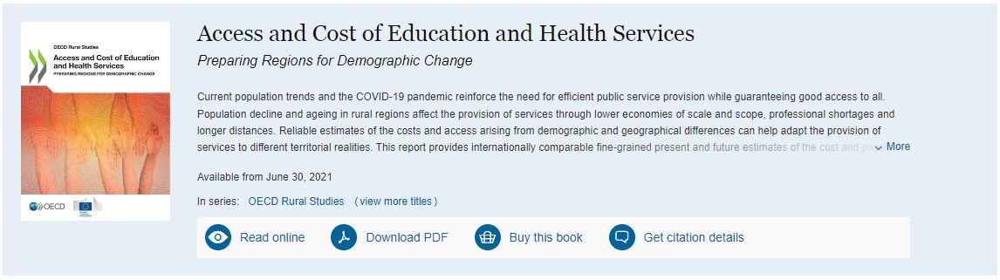
```

---

#  Conclusiones

.panelset[

.panel[.panel-name[Una]

.bg-washed-green.b--dark-green.ba.bw2.br3.shadow-5.ph4.mt4[

- La accesibilidad geográfica a servicios básicos de interés general —sanidad, educación o entidades bancarias— es buena con generalidad para el conjunto de la población.

- La mayor parte de la población tiene acceso básico a esos servicios en distancias y tiempos razonables.

- La población sin acceso a esos servicios en un umbral de tiempo prudencial es reducida, sobre todo en los servicios financieros.

]

]

.panel[.panel-name[Dos]

.bg-washed-green.b--dark-green.ba.bw2.br3.shadow-5.ph4.mt4[

- Esta accesibilidad geográfica tiene, sin embargo, **dos velocidades**.

- Una de **crucero** para la gran mayoría de la población, generalmente urbana.

- Otra a **cámara lenta** para una parte muy reducida de la misma. Esta pequeña parte de la población, normalmente de carácter rural, debe desplazarse con tiempos relativamente largos, digamos en exceso a los 15 minutos, para acceder a servicios básicos —centros de salud, centros educativos u oficinas bancarias— disponibles en mucho menor tiempo en un mundo más urbanizado. Tiempos mucho mayores, en exceso a los 45 minutos, para el acceso a un hospital.

]

]

.panel[.panel-name[Tres]

.bg-washed-green.b--dark-green.ba.bw2.br3.shadow-5.ph4.mt4[

- La población con peores condiciones de accesibilidad tiene características muy específicas —es población mayor, que reside en municipios de tamaño muy reducido, normalmente de montaña y con malas comunicaciones—

- Al mismo tiempo está muy localizada geográficamente en amplias zonas del interior peninsular.

- Algunas zonas aparecen repetidamente entre las que muestran peores condiciones de accesibilidad independientemente del servicio: Teruel, Cuenca, Guadalajara y varias provincias de Castilla y León como Soria, Segovia o Ávila.

- En cierta forma, y a grandes rasgos, el mapa de la accesibilidad es similar al mapa de distribución de la población.

]

]

.panel[.panel-name[Cuatro]

.bg-washed-green.b--dark-green.ba.bw2.br3.shadow-5.ph4.mt4[

- Esta dualidad, facilidad en el acceso geográfico a los centros de servicios para la gran mayoría de la población y dificultad para unos pocos, es el resultado, en gran parte, de nuestro modelo de asentamiento de la población.

- La elevada concentración de la misma en unos pocos lugares facilita el acceso geográfico a los servicios públicos, al tiempo que acota en el espacio la población con peor acceso.

]

]

.panel[.panel-name[Cinco]

.bg-washed-green.b--dark-green.ba.bw2.br3.shadow-5.ph4.mt4[

- ¿Existe la denominada **penalización rural**? **Sí**, claramente, pero sobre todo en la **rural remota**.

- Y afortunamente está bastante acotada, `r emo::ji("+1")`.

- Estos colectivos vulnerables deberán recibir atención especial, teniendo en cuenta el coste de oportunidad.

- El principio de **equidad territorial**, así como la obligatoriedad por parte de las administraciones públicas de prestar ciertos servicios básicos, requiere acciones correctoras para la población con peor acceso, teniendo en cuenta el conflicto eficiencia-equidad.

]

]

]

---

background-image: url(https://www.ivie.es/wp-content/uploads/2017/02/logo.jpg), url(https://www.uv.es/recursos/fatwirepub/css/logoPeu.png)
background-position: 95% 5%, 5% 95%
background-size: 12%, 20%

class: center, middle

# ¡Gracias por la atención!

## .green[¿Preguntas?]

???

Slides created via the _R_ package [**xaringan**](https://github.com/yihui/xaringan).
